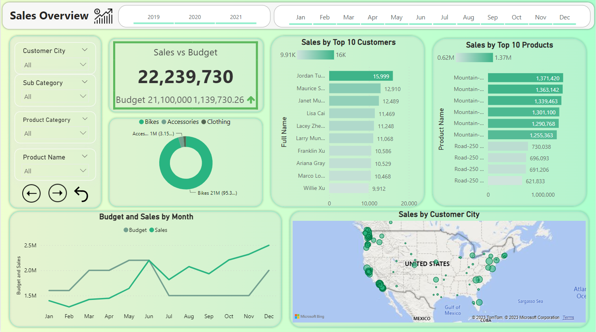
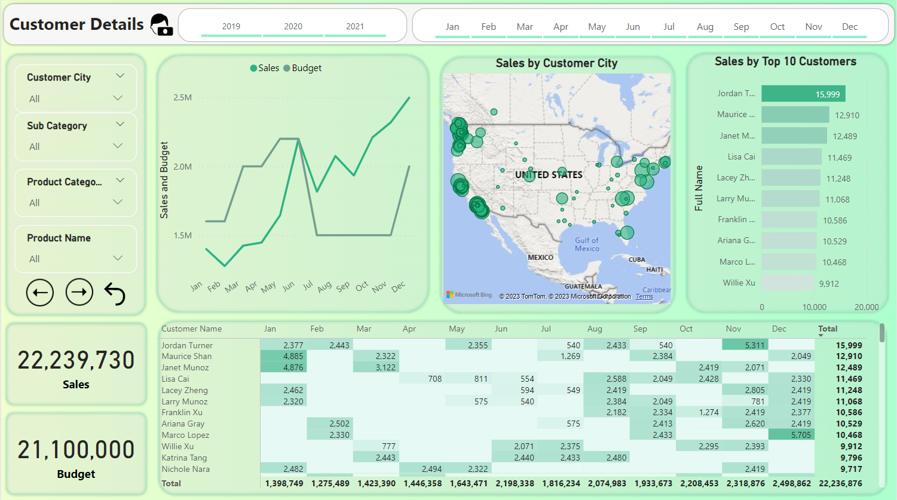
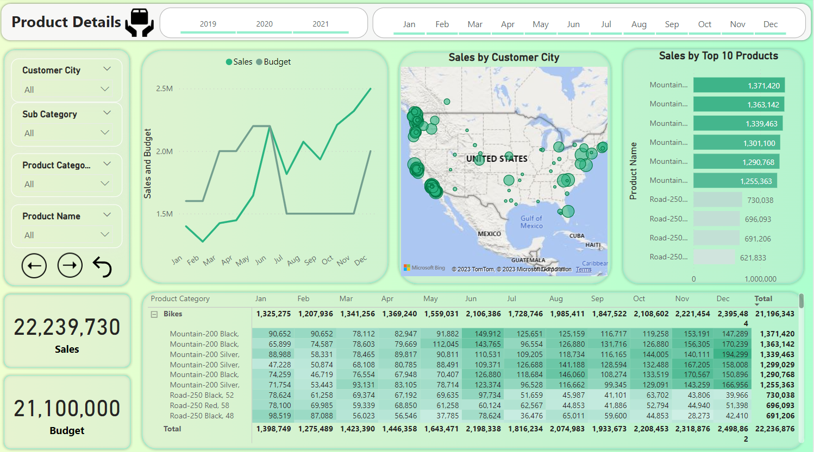

# Sales Dashboard Project

## Overview

This project aims to enhance internet sales reporting for a company, moving from static reports to dynamic visual dashboards. The project was initiated by Steven, the Sales Manager, who provided specific requirements and expectations.

## Business Request

**Reporter:** Steven - Sales Manager

**Value of Change:** Visual dashboards and improved sales reporting for better follow-up and sales force management.

**Necessary Systems:** Power BI, CRM System

**Other Relevant Info:** Budgets for 2021 have been delivered in Excel.

## User Stories

1. **Sales Manager**
   - *Request:* To get a dashboard overview of internet sales.
   - *User Value:* Can follow better which customers and products sell the best.
   - *Acceptance Criteria:* A Power BI dashboard which updates data once a day.

2. **Sales Representative**
   - *Request:* A detailed overview of Internet Sales per Customers.
   - *User Value:* Can follow up on customers that buy the most and identify potential opportunities.
   - *Acceptance Criteria:* A Power BI dashboard allowing data filtering for each customer.

3. **Sales Representative**
   - *Request:* A detailed overview of Internet Sales per Products.
   - *User Value:* Can track and analyze product performance.
   - *Acceptance Criteria:* A Power BI dashboard allowing data filtering for each product.

4. **Sales Manager**
   - *Request:* A dashboard overview of internet sales.
   - *User Value:* Monitor sales over time against budget.
   - *Acceptance Criteria:* A Power BI dashboard with graphs and KPIs comparing against the budget.

## Data Extraction Queries (SQL Server)

- [FACT_InternetSales Query](/Power BI + SQL Project/Data Transformation/FACT_InternetSales.sql)
- [DIM_Calendar Query](/Power BI + SQL Project/Data Transformation/DIM_Calendar.sql)
- [DIM_Customers Query](/Power BI + SQL Project/Data Transformation/DIM_Customers.sql)
- [DIM_Products Query](/Power BI + SQL Project/Data Transformation/DIM_Products.sql)

## Power BI Setup

1. Loaded CSVs into Power BI.
2. Connected tables in the Data Model.
3. Loaded SalesBudget data and connected it.

## Power BI Pages

### 1. Sales Overview

- Custom visuals presenting sales data over time.
- Graphs and KPIs comparing against the budget.

### 2. Customer Details

- Detailed information on internet sales per customer.
- Data filtering for each customer.

### 3. Product Details

- Detailed information on internet sales per product.
- Data filtering for each product.

## How to Use

1. Clone the repository.
2. Open the Power BI file.
3. Navigate through the pages to explore sales data.

Feel free to reach out if you have any questions or suggestions!
